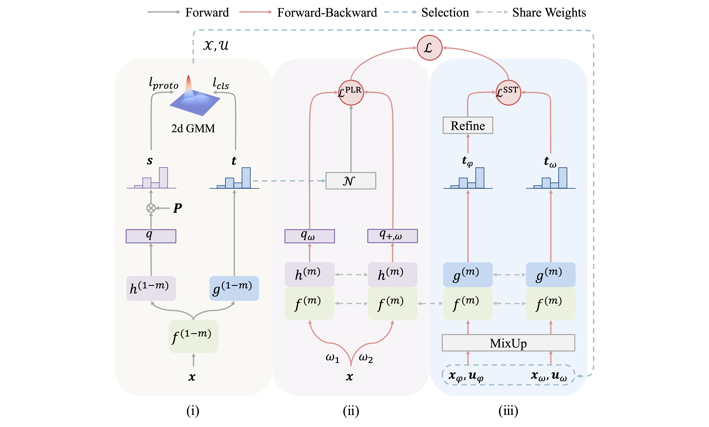

# PLReMix: Combating Noisy Labels with Pseudo-Label Relaxed Contrastive Representation Learning

<h5 align="center">

*Xiaoyu Liu, Beitong Zhou, Cheng Cheng*

[](https://arxiv.org/abs/2402.17589)
[](https://github.com/nazmul-karim170/UNICON-Noisy-Label/blob/main/LICENSE)

</h5>

The PyTorch implementation code of the paper, [PLReMix: Combating Noisy Labels with Pseudo-Label Relaxed Contrastive Representation Learning](https://arxiv.org/abs/2402.17589).

**Abstract**
Recently, the usage of Contrastive Representation Learning (CRL) as a pre-training technique improves the performance of learning with noisy labels (LNL) methods. However, instead of pre-training, when trivially combining CRL loss with LNL methods as an end-to-end framework, the empirical experiments show severe degeneration of the performance. We verify through experiments that this issue is caused by optimization conflicts of losses and propose an end-to-end **PLReMix** framework by introducing a Pseudo-Label Relaxed (PLR) contrastive loss. This PLR loss constructs a reliable negative set of each sample by filtering out its inappropriate negative pairs, alleviating the loss conflicts by trivially combining these losses. The proposed PLR loss is pluggable and we have integrated it into other LNL methods, observing their improved performance. Furthermore, a two-dimensional Gaussian Mixture Model is adopted to distinguish clean and noisy samples by leveraging semantic information and model outputs simultaneously. Experiments on multiple benchmark datasets demonstrate the effectiveness of the proposed method. Codes will be available.



[//]: # ()

## Installation

```shell
git clone https://github.com/lxysl/PLReMix.git
cd PLReMix
# Please install PyTorch using the official installation instructions (https://pytorch.org/get-started/locally/).
pip install -r requirements.txt
```

## Training

> We enable wandb logging by default.
> If you want to disable it, use the `--no_wandb` flag.
> You can also use the `--offline` flag to enable the offline logging mode.
> 
> We offer the resume training feature if you enable wandb logging.
> If you want to resume training from a specific run, use `--resume_id <run_id>`.
> The `run_id` can be found in the wandb dashboard.

To train on the CIFAR-10 dataset, run the following command:

```shell
python train.py --r 0.2 --lambda_u 0
python train.py --r 0.5 --lambda_u 25
python train.py --r 0.8 --lambda_u 25
python train.py --r 0.9 --lambda_u 50
python train.py --r 0.4 --noise_mode asym --lambda_u 0
```

To train on the CIFAR-100 dataset, run the following command:

```shell
python train.py --dataset cifar100 --data_path ./data/cifar100/ --r 0.2 --lambda_u 0
python train.py --dataset cifar100 --data_path ./data/cifar100/ --r 0.5 --lambda_u 150
python train.py --dataset cifar100 --data_path ./data/cifar100/ --r 0.8 --lambda_u 150
python train.py --dataset cifar100 --data_path ./data/cifar100/ --r 0.9 --lambda_u 150
python train.py --dataset cifar100 --data_path ./data/cifar100/ --r 0.4 --noise_mode asym --lambda_u 0
```

To train on the TinyImageNet dataset, run the following command:

```shell
cd data && bash prepare_tiny_imagenet.sh && cd ..
python train.py --dataset tiny_imagenet --data_path ./data/tiny-imagenet-200 --r 0 --lambda_u 0
python train.py --dataset tiny_imagenet --data_path ./data/tiny-imagenet-200 --r 0.2 --lambda_u 30
python train.py --dataset tiny_imagenet --data_path ./data/tiny-imagenet-200 --r 0.5 --lambda_u 200
python train.py --dataset tiny_imagenet --data_path ./data/tiny-imagenet-200 --r 0.8 --lambda_u 300
python train.py --dataset tiny_imagenet --data_path ./data/tiny-imagenet-200 --r 0.45 --noise_mode asym --lambda_u 0
```

To train on the Clothing1M dataset, prepare the dataset and run the following command:

<details>
<summary>Clothing1M dataset file structure (You need to download the dataset from the corresponding website.)</summary>

```shell
.
├── category_names_chn.txt
├── category_names_eng.txt
├── clean_label_kv.txt
├── clean_test_key_list.txt
├── clean_train_key_list.txt
├── clean_val_key_list.txt
├── images
│   ├── 0
│   ├── 1
│   ├── 2
│   ├── 3
│   ├── 4
│   ├── 5
│   ├── 6
│   ├── 7
│   ├── 8
│   └── 9
├── noisy_label_kv.txt
├── noisy_train_key_list.txt
├── README.md
└── venn.png
```
</details>

```shell
python train_clothing1m.py --dataset clothing1m --data_path ~/Documents/Clothing1M/ --pretrain
```

To train on the WebVision dataset, prepare the dataset and run the following command:

<details>
<summary>WebVision dataset file structure (You need to download the dataset from the corresponding website.)</summary>

```shell
.
├── flickr
├── google
├── ILSVRC2012_devkit_t12
├── imagenet
│   └── val
├── info
│   ├── queries_flickr.txt
│   ├── queries_google.txt
│   ├── queries_synsets_map.txt
│   ├── synsets.txt
│   ├── test_filelist.txt
│   ├── train_filelist_flickr.txt
│   ├── train_filelist_google.txt
│   ├── train_meta_list_all.txt
│   ├── train_meta_list_flickr.txt
│   ├── train_meta_list_google.txt
│   └── val_filelist.txt
├── test_images_256
├── val_images_256
```

</details>

```shell
python train_webvision.py --dataset webvision --data_path ~/Documents/WebVision/ --mcrop
```

----

## Citation

If you have any questions, do not hesitate to contact lxy764139720@gmail.com

Also, if you find our work useful please consider citing our work:

```bibtex
@misc{liu2024plremix,
    title={PLReMix: Combating Noisy Labels with Pseudo-Label Relaxed Contrastive Representation Learning},
    author={Xiaoyu Liu and Beitong Zhou and Cheng Cheng},
    year={2024},
    eprint={2402.17589},
    archivePrefix={arXiv},
    primaryClass={cs.CV}
}
```

## Acknowledgement

* [DivideMix](https://github.com/LiJunnan1992/DivideMix): The algorithm that our framework is based on.
* [ScanMix](https://github.com/ragavsachdeva/ScanMix): The codebase that we used as a reference for our implementation.
* [SupContrast](https://github.com/HobbitLong/SupContrast): The codebase that our PLR loss is based on.
* [FlatCLR](https://github.com/Junya-Chen/FlatCLR): The codebase that the Flat version of our PLR loss is based on.
* [MoPro](https://github.com/salesforce/MoPro): Inspiration for using the prototypes.
